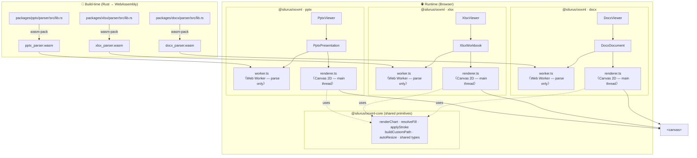

> **This entire codebase — Rust parsers, TypeScript renderers, tests, and tooling — was implemented by [Claude](https://claude.ai)** (Anthropic's AI assistant) through iterative prompting. No human-written application code exists in this repository.

<p align="center">
  
</p>

# Office Open XML Viewer

[](https://www.npmjs.com/package/@silurus/ooxml)
[](https://www.npmjs.com/package/@silurus/ooxml)
[](https://marketplace.visualstudio.com/items?itemName=silurus.office-open-xml-viewer)
[](./LICENSE)

**[Live demo](https://ooxml.silurus.dev)**

A browser-based viewer for Office Open XML documents that renders to an HTML Canvas element.
The parsers are written in Rust and compiled to WebAssembly; the renderers use the Canvas 2D API.
Each format also exposes a headless engine (`DocxDocument` / `XlsxWorkbook` / `PptxPresentation`) that renders into any caller-supplied canvas, so you can compose your own UI — scroll views, thumbnail grids, master-detail panes — instead of being locked into the built-in viewer. See the `Examples` section in [the Storybook demo](https://ooxml.silurus.dev/storybook/).

| DOCX | XLSX | PPTX |
|:---:|:---:|:---:|
|  |  |  |

```bash
npm install @silurus/ooxml
# or
pnpm add @silurus/ooxml
```

> **Bundler note**: the Rust parsers ship as real `.wasm` asset files next to the
> JavaScript, referenced with the standard `new URL('…', import.meta.url)` form
> and fetched (streaming-compiled) at load time. Verified to work with zero
> config: **webpack 5**, **Next.js** (Turbopack, dev and build), **Vite 8**
> (dev and build), **Vite 7 production builds**, and a plain
> `<script type="module">` with no bundler at all. Two setups need a hand:
>
> - **Vite 7 dev server**: the dependency optimizer rewrites the asset reference
>   into its own cache path and the load fails (fixed in Vite 8). Add
>   `optimizeDeps: { exclude: ['@silurus/ooxml'] }` to your `vite.config` —
>   production builds are unaffected.
> - **esbuild / Angular CLI** (whose application builder is esbuild-based):
>   `new URL` asset references are not processed
>   ([esbuild#795](https://github.com/evanw/esbuild/issues/795)). Copy the
>   `.wasm` into your served output and point the viewer at it with the
>   `wasmUrl` load option — see the [Angular example](#framework-examples) for
>   the two-step setup.
>
> `wasmUrl` also serves the parser WASM from a CDN or any path you control:
>
> ```typescript
> new DocxViewer(canvas, { wasmUrl: 'https://cdn.example.com/docx_parser_bg.wasm' });
> ```

> **Bundle size note**: the package is ESM-only (`.mjs`). npm's *Unpacked Size* sums every entry bundle **and** the standalone MathJax + STIX Two Math asset (`mathjax-stix2.js`, ~3 MB) that ships in the tarball, so the reported figure is much larger than any single app build. What actually lands in your app is smaller on two counts: import only the format you need (e.g. `@silurus/ooxml/pptx`), and the math engine is a **separate entry** (`@silurus/ooxml/math`). Its main-thread chunk is a ~1 KB loader that references the ~3 MB engine asset as a **sibling file** (not an inline data URL): the engine is fetched **lazily, only when a document actually contains equations** — and only if you imported `@silurus/ooxml/math` and passed it to a viewer in the first place (see [Rendering equations](#rendering-equations)). Never import the `math` entry and the loader chunk never enters your graph at all.

---

## Quick Start

```typescript
import { DocxViewer } from '@silurus/ooxml/docx';
import { XlsxViewer } from '@silurus/ooxml/xlsx';
import { PptxViewer } from '@silurus/ooxml/pptx';

// DOCX — caller provides the <canvas>
const canvas = document.getElementById('docx-canvas') as HTMLCanvasElement;
const docx = new DocxViewer(canvas);
await docx.load('/document.docx');
docx.nextPage();

// XLSX — viewer manages its own <canvas> + tab bar
const container = document.getElementById('xlsx-container') as HTMLElement;
const xlsx = new XlsxViewer(container);
await xlsx.load('/workbook.xlsx');

// PPTX — caller provides the <canvas>
const canvas = document.getElementById('pptx-canvas') as HTMLCanvasElement;
const pptx = new PptxViewer(canvas);
await pptx.load('/deck.pptx');
pptx.nextSlide();
```

### Rendering equations

OMML equations (`m:oMath` / `m:oMathPara`) in `.docx`, `.pptx` and `.xlsx` are rendered with
[MathJax](https://www.mathjax.org/) + [STIX Two Math](https://github.com/stipub/stixfonts).
That engine is ~3 MB, so it is **opt-in**: import the `math` engine from the separate
`@silurus/ooxml/math` entry and pass it to the viewer. Pass it and equations render;
omit it and the engine is referenced nowhere, so a bundler leaves it out of your build
entirely (equations are simply skipped). When you *do* pass it, the ~3 MB engine ships
as a **standalone asset file** next to the bundle rather than an inline data URL, and is
fetched **on demand — only the first time a document actually contains an equation**, so
equation-free documents never pay for it. It is fully self-contained: served from your own
origin, no cross-origin requests.

```typescript
import { DocxViewer } from '@silurus/ooxml/docx';
import { math } from '@silurus/ooxml/math';

const canvas = document.getElementById('docx-canvas') as HTMLCanvasElement;
const docx = new DocxViewer(canvas, { math }); // ← equations now render
await docx.load('/paper-with-equations.docx');
```

The same `math` engine works for every viewer (`DocxViewer`, `PptxViewer`,
`XlsxViewer`) and every headless engine (`DocxDocument`, `PptxPresentation`,
`XlsxWorkbook`). You inject it **once** where you create the object — the viewer
constructor or the `.load()` options — and every render reuses it; it is never a
per-render argument. (Excel stores "Insert > Equation" as OMML inside the shared
DrawingML `<xdr:txBody>` grammar, so `XlsxViewer` renders equations embedded in
shapes / text boxes the same way.)

### Off-main-thread rendering

By default the headless engines parse in a worker but render on the main thread.
Pass `mode: 'worker'` to `.load()` to parse **and** render entirely inside a Web
Worker — the main thread only paints the returned `ImageBitmap` via a
`bitmaprenderer` context, keeping it free for scrolling and input. It requires
`Worker` + `OffscreenCanvas`.

```typescript
import { PptxPresentation } from '@silurus/ooxml/pptx';

// Render entirely inside a Web Worker — the main thread only paints bitmaps.
const pres = await PptxPresentation.load('/deck.pptx', { mode: 'worker' });
const canvas = document.getElementById('pptx-canvas') as HTMLCanvasElement;
const bitmap = await pres.renderSlideToBitmap(0, { width: 960, dpr: window.devicePixelRatio });
const ctx = canvas.getContext('bitmaprenderer') as ImageBitmapRenderingContext;
ctx.transferFromImageBitmap(bitmap); // consumes the bitmap
```

The `*ToBitmap` method exists on all three engines —
`PptxPresentation.renderSlideToBitmap(slideIndex, opts)`,
`DocxDocument.renderPageToBitmap(pageIndex, opts)`, and
`XlsxWorkbook.renderViewportToBitmap(sheetIndex, viewport, opts)` (the xlsx
variant **requires** `opts.width` and `opts.height`, since a worker has no DOM
element to measure). They work in **both** modes — in main mode they render to
an internal `OffscreenCanvas` — so you can write mode-agnostic code.

Notes:

- The returned `ImageBitmap` is owned by the caller: `transferFromImageBitmap`
  consumes it, or call `bitmap.close()` when done.
- The canvas-target methods (`renderSlide(canvas)`, `renderPage(canvas)`,
  `renderViewport(canvas)`) are unavailable in worker mode — use the `*ToBitmap`
  variants instead.
- OMML equations require `mode: 'main'`; in worker mode they are skipped (with a
  console warning).
- Trade-off: worker mode keeps the main thread responsive, but each frame is
  transferred back as an `ImageBitmap`, so a single render can be marginally
  slower than `mode: 'main'`. Choose it for non-blocking UI, not raw speed.

### Continuous scroll viewers

`DocxScrollViewer` and `PptxScrollViewer` render the whole document as one
vertically-scrolling, PDF-reader-style surface instead of a single page/slide at
a time. Unlike `DocxViewer` / `PptxViewer` (which take a `<canvas>`), the scroll
viewers take a **container** `<div>` — they own the scroll host, virtualize the
page/slide list (only the visible window plus a small overscan is mounted), and
recycle canvases as you scroll.

```typescript
import { DocxScrollViewer } from '@silurus/ooxml/docx';

const container = document.getElementById('docx-scroll') as HTMLElement;
const viewer = new DocxScrollViewer(container);
await viewer.load('/document.docx');
// viewer.scrollToPage(3);
// viewer.pageCount, viewer.topVisiblePage
```

```typescript
import { PptxScrollViewer } from '@silurus/ooxml/pptx';

const container = document.getElementById('pptx-scroll') as HTMLElement;
const viewer = new PptxScrollViewer(container);
await viewer.load('/deck.pptx');
// viewer.scrollToSlide(2);
// viewer.slideCount, viewer.topVisibleSlide
```

The container must have a bounded height (e.g. `height: 100vh` or a flex child)
so the viewer can size its scroll host to it. Base zoom fits the first page/slide
width to the container width and re-fits on resize; a `0`-width container defers
layout until it has width. Call `destroy()` to tear down (a self-loaded engine is
destroyed with it; an injected one is not — see below).

**Desk appearance.** The viewer paints each page/slide on its own white canvas
with a soft drop shadow, over a transparent "desk". Style the desk and the sheet
gaps without any wrapper CSS:

```typescript
const viewer = new DocxScrollViewer(container, {
  background: '#f3f4f6',            // the desk behind / between pages
  gap: 24,                          // vertical gap between pages
  paddingTop: 32,                   // desk padding above the first page
  pageShadow: '0 0 0 1px #c8ccd0',  // crisp 1px "border" look (box-shadow never shifts layout)
  // pageShadow: false,             // flat pages, no shadow
});
```

`paddingBottom`, `paddingLeft` and `paddingRight` each default to `gap`, so the
sheet sits inside a uniform desk margin; pass `0` for a flush edge.

**Zoom.** `Ctrl`/`⌘` + mouse-wheel (and trackpad pinch) zooms the surface;
bare-wheel still scrolls natively. Zoom is flicker-free — a rapid gesture shows a
CSS preview and settles into a crisp re-render when it pauses. Bounds are the
absolute scale factors `zoomMin` / `zoomMax` (default `0.1` / `4`), and
`setScale(scale)` sets it programmatically. Pass `enableZoom: false` to disable.

**Text selection** (main mode only). Pass `enableTextSelection: true` to overlay
a transparent, selectable text layer per page/slide for native copy. In
`mode: 'worker'` the overlay stays empty (the per-run geometry cannot cross the
worker boundary) and the viewer logs one warning — use the default `mode: 'main'`
for selectable text.

**Master–detail / shared engine.** Inject an already-loaded headless engine so a
paged viewer and a scroll viewer (or several panes) share **one** parse. When you
inject, `load()` is unsupported (the engine is already loaded), the engine's own
`mode` wins, and `destroy()` leaves the injected engine intact — the caller owns
its lifecycle:

```typescript
import { DocxDocument, DocxScrollViewer } from '@silurus/ooxml/docx';

const doc = await DocxDocument.load('/document.docx'); // parse once
const scroll = new DocxScrollViewer(container, { document: doc });
// ...also drive a thumbnail grid, a paged view, etc. from the same `doc`.
scroll.destroy(); // the injected `doc` is NOT destroyed — you own it
doc.destroy();    // release it yourself when every pane is gone
```

`PptxScrollViewer` takes the same shape with `{ presentation: pres }`
(`await PptxPresentation.load(...)`).

Both viewers also expose `relayout()` (force a re-fit when the container resizes
in a way a `ResizeObserver` cannot see — e.g. a late web-font load),
`onVisiblePageChange` / `onVisibleSlideChange` (fires when the top-most visible
page/slide changes), and `onError` (async per-page render failures are routed
here instead of crashing the scroll loop). The parse/render knobs from the
headless engines (`mode`, `useGoogleFonts`, `maxZipEntryBytes`, `math`, `dpr`)
are accepted too.

---

<details>
<summary><strong>Architecture diagram</strong></summary>



All three formats follow the same shape: the worker parses the `.docx` / `.xlsx` / `.pptx` archive via WASM and posts a JSON model back to the main thread, where the renderer draws to the canvas. Rendering stays on the main thread so the canvas shares the document's `FontFaceSet` — an `OffscreenCanvas` in a worker has its own font registry and would silently fall back to a system font, producing subtly different text measurements (and wrap positions) from the installed theme webfonts. `@silurus/ooxml-core` holds the cross-format primitives that the three renderers all depend on: a unified chart renderer (bar / line / area / radar / waterfall), shape helpers (`resolveFill`, `applyStroke`, `buildCustomPath`, `hexToRgba`), the `autoResize` viewer utility, and the shared type definitions.

### Key files

| File | Role |
|------|------|
| `packages/docx/parser/src/lib.rs` | Rust WASM parser — DOCX ZIP → `Document` JSON |
| `packages/xlsx/parser/src/lib.rs` | Rust WASM parser — XLSX ZIP → `Workbook` JSON |
| `packages/pptx/parser/src/lib.rs` | Rust WASM parser — PPTX ZIP → `Presentation` JSON |
| `packages/docx/src/renderer.ts` | Canvas 2D rendering engine with text layout (main thread) |
| `packages/xlsx/src/renderer.ts` | Canvas 2D rendering engine with virtual scroll (main thread) |
| `packages/pptx/src/renderer.ts` | Canvas 2D rendering engine (main thread) |
| `packages/*/src/worker.ts` | Web Worker: WASM init and parsing only (one per format) |
| `packages/*/src/viewer.ts` | Public Viewer API — canvas lifecycle, navigation |
| `packages/core/src/index.ts` | Cross-format primitives — chart renderer, shape helpers, `autoResize`, shared types |

</details>

---

## Framework Examples

<details>
<summary><strong>React 19</strong></summary>

```tsx
// React 19.1 — Vite copies the parser .wasm asset automatically; no extra plugin needed.
import { useEffect, useRef, useState } from 'react';
import { PptxViewer } from '@silurus/ooxml/pptx';

export function PptxViewerComponent({ src }: { src: string }) {
  const canvasRef  = useRef<HTMLCanvasElement>(null);
  const viewerRef  = useRef<PptxViewer | null>(null);
  const [slide, setSlide] = useState({ current: 0, total: 0 });

  useEffect(() => {
    const canvas = canvasRef.current;
    if (!canvas) return;

    const viewer = new PptxViewer(canvas, {
      onSlideChange: (i, total) => setSlide({ current: i, total }),
    });
    viewerRef.current = viewer;
    viewer.load(src);
  }, [src]);

  return (
    <div>
      <canvas ref={canvasRef} style={{ width: 800 }} />
      <button onClick={() => viewerRef.current?.prevSlide()}>‹ Prev</button>
      <span> {slide.current + 1} / {slide.total} </span>
      <button onClick={() => viewerRef.current?.nextSlide()}>Next ›</button>
    </div>
  );
}
```

</details>

<details>
<summary><strong>Vue 3.5</strong></summary>

```vue
<!-- Vue 3.5 — useTemplateRef is a 3.5+ feature -->
<script setup lang="ts">
import { useTemplateRef, onMounted, ref } from 'vue';
import { PptxViewer } from '@silurus/ooxml/pptx';

const props = defineProps<{ src: string }>();

const canvas  = useTemplateRef<HTMLCanvasElement>('canvas');
let viewer: PptxViewer | null = null;
const current = ref(0);
const total   = ref(0);

onMounted(async () => {
  viewer = new PptxViewer(canvas.value!, {
    onSlideChange: (i, t) => { current.value = i; total.value = t; },
  });
  await viewer.load(props.src);
});
</script>

<template>
  <div>
    <canvas ref="canvas" style="width: 800px" />
    <button @click="viewer?.prevSlide()">‹ Prev</button>
    <span> {{ current + 1 }} / {{ total }} </span>
    <button @click="viewer?.nextSlide()">Next ›</button>
  </div>
</template>
```

</details>

<details>
<summary><strong>Angular 19</strong></summary>

The Angular CLI's esbuild-based builder does not process the `new URL('…', import.meta.url)`
asset reference the parsers use ([angular-cli#22388](https://github.com/angular/angular-cli/issues/22388)),
so the `.wasm` never reaches the build output — and under `ng serve` the dependency
optimizer additionally rewrites the reference into its own cache path. **Both steps
below are required** (the asset copy alone fixes only production builds; `ng serve`
still 404s without `wasmUrl`):

```jsonc
// angular.json — copy the parser WASM into the served root
// (restart `ng serve` after editing this file)
"architect": {
  "build": {
    "options": {
      "assets": [
        { "glob": "*_parser_bg.wasm", "input": "node_modules/@silurus/ooxml/dist", "output": "/" },
        { "glob": "**/*", "input": "public" }
      ]
    }
  }
}
```

```typescript
// Angular 19 — standalone component with signal-based state
import {
  Component, ElementRef, viewChild,
  signal, AfterViewInit,
} from '@angular/core';
import { PptxViewer } from '@silurus/ooxml/pptx';

@Component({
  selector: 'app-pptx-viewer',
  standalone: true,
  template: `
    <div>
      <canvas #canvas style="width: 800px"></canvas>
      <button (click)="prev()">‹ Prev</button>
      <span> {{ current() + 1 }} / {{ total() }} </span>
      <button (click)="next()">Next ›</button>
    </div>
  `,
})
export class PptxViewerComponent implements AfterViewInit {
  canvasEl = viewChild.required<ElementRef<HTMLCanvasElement>>('canvas');
  current = signal(0);
  total   = signal(0);
  private viewer?: PptxViewer;

  ngAfterViewInit(): void {
    this.viewer = new PptxViewer(this.canvasEl().nativeElement, {
      wasmUrl: '/pptx_parser_bg.wasm',
      onSlideChange: (i, t) => { this.current.set(i); this.total.set(t); },
    });
    this.viewer.load('/deck.pptx');
  }

  prev(): void { this.viewer?.prevSlide(); }
  next(): void { this.viewer?.nextSlide(); }
}
```

> The `*_parser_bg.wasm` glob copies all three parsers; narrow it to
> `pptx_parser_bg.wasm` if you only use one format. If you deploy under a
> non-root `base href`, adjust `wasmUrl` so it resolves under your base (a
> relative `wasmUrl` is resolved against the document URL).

</details>

<details>
<summary><strong>Svelte 5</strong></summary>

```svelte
<!-- Svelte 5 — runes syntax ($props, $state) -->
<script lang="ts">
  import { onMount } from 'svelte';
  import { PptxViewer } from '@silurus/ooxml/pptx';

  let { src }: { src: string } = $props();

  let canvas: HTMLCanvasElement;
  let viewer: PptxViewer;
  let current = $state(0);
  let total   = $state(0);

  onMount(async () => {
    viewer = new PptxViewer(canvas, {
      onSlideChange: (i, t) => { current = i; total = t; },
    });
    await viewer.load(src);
  });
</script>

<div>
  <canvas bind:this={canvas} style="width: 800px"></canvas>
  <button onclick={() => viewer?.prevSlide()}>‹ Prev</button>
  <span> {current + 1} / {total} </span>
  <button onclick={() => viewer?.nextSlide()}>Next ›</button>
</div>
```

</details>

<details>
<summary><strong>SolidJS 1.9</strong></summary>

```tsx
// SolidJS 1.9
import { createSignal, onMount, onCleanup } from 'solid-js';
import { PptxViewer } from '@silurus/ooxml/pptx';

export function PptxViewerComponent(props: { src: string }) {
  let canvasEl!: HTMLCanvasElement;
  let viewer: PptxViewer | undefined;
  const [current, setCurrent] = createSignal(0);
  const [total,   setTotal  ] = createSignal(0);

  onMount(async () => {
    viewer = new PptxViewer(canvasEl, {
      onSlideChange: (i, t) => { setCurrent(i); setTotal(t); },
    });
    await viewer.load(props.src);
  });

  onCleanup(() => { /* viewer?.destroy?.() */ });

  return (
    <div>
      <canvas ref={canvasEl} style={{ width: '800px' }} />
      <button onClick={() => viewer?.prevSlide()}>‹ Prev</button>
      <span> {current() + 1} / {total()} </span>
      <button onClick={() => viewer?.nextSlide()}>Next ›</button>
    </div>
  );
}
```

</details>

<details>
<summary><strong>Qwik 2</strong></summary>

```tsx
// Qwik 2.0 — dynamic import to keep WASM out of SSR bundle
import { component$, useSignal, useVisibleTask$ } from '@builder.io/qwik';
import type { PptxViewer as PptxViewerType } from '@silurus/ooxml/pptx';

export const PptxViewerComponent = component$<{ src: string }>(({ src }) => {
  const canvasRef = useSignal<HTMLCanvasElement>();
  const current = useSignal(0);
  const total   = useSignal(0);
  let viewer: PptxViewerType | undefined;

  // useVisibleTask$ runs only in the browser, never during SSR
  useVisibleTask$(async () => {
    if (!canvasRef.value) return;
    const { PptxViewer } = await import('@silurus/ooxml/pptx');
    viewer = new PptxViewer(canvasRef.value, {
      onSlideChange: (i, t) => { current.value = i; total.value = t; },
    });
    await viewer.load(src);
  });

  return (
    <div>
      <canvas ref={canvasRef} style={{ width: '800px' }} />
      <button onClick$={() => viewer?.prevSlide()}>‹ Prev</button>
      <span> {current.value + 1} / {total.value} </span>
      <button onClick$={() => viewer?.nextSlide()}>Next ›</button>
    </div>
  );
});
```

</details>

---

## Feature Support

### Word (.docx)

| Category | Feature | Status |
|----------|---------|--------|
| **Document** | Page rendering | ✅ |
| | Page size and margins | ✅ |
| | Headers / footers (default / first / even) | ✅ |
| | Section breaks (continuous / nextPage / oddPage / evenPage) | ✅ |
| **Text** | Paragraphs | ✅ |
| | Bold, italic, underline, strikethrough | ✅ |
| | Font family, size, color | ✅ |
| | Hyperlinks | ✅ |
| | Superscript / subscript (`w:vertAlign`) | ✅ |
| | Ruby annotations / furigana (`w:ruby`) | ✅ |
| **Formatting** | Paragraph alignment (left / center / right / justify / distribute — CJK `both`/`distribute` spread by inter-character pitch, §17.18.44) | ✅ |
| | Line spacing (auto / atLeast / exact) | ✅ |
| | Document grid (`w:docGrid`, §17.6.5 — line pitch + East Asian character grid / 字詰め) | ✅ |
| | Margin collapsing between paragraphs | ✅ |
| | Indents and tab stops | ✅ |
| | Multi-column section layout (`w:cols`, §17.6.4 — newspaper-flow columns; full-width floats span all columns) | ✅ |
| | Lists (bullet and numbered, multi-level `%N` markers §17.9.11) | ✅ |
| | Paragraph styles (Heading 1–9, Normal, custom) | ✅ |
| | Table style `w:pPr` cascade (§17.7.6) | ✅ |
| | Table style borders / shading / banding (`tblStylePr`, `cnfStyle`, §17.4.7) | ✅ |
| | Table of contents (TOC field) — dot leaders, right-aligned page numbers | ✅ |
| | keepNext / keepLines / widowControl | ✅ |
| | Right-to-left text — UAX#9 bidi, `w:bidi` / `w:rtl`, complex-script formatting (`w:szCs` / `w:bCs` / `rFonts@cs`, §17.3.2.26), RTL lists and indents | ✅ |
| | Japanese kinsoku line breaking (`w:kinsoku`, §17.15.1.58 — 行頭/行末禁則) | ✅ |
| **Elements** | Tables (with borders, fills, merges, banding, alignment) | ✅ |
| | Table auto-layout by preferred widths (`w:tblLayout` autofit, §17.4.52; min content width) | ✅ |
| | Right-to-left table column order (`w:bidiVisual`, §17.4.1) | ✅ |
| | Math equations (OMML `m:oMath` / `m:oMathPara`, rendered via MathJax — opt-in `@silurus/ooxml/math`) | ✅ |
| | Images (inline and anchored, with text wrap) | ✅ |
| | SVG images (`asvg:svgBlip` MS-2016 extension — vector drawn from the embedded `.svg`, raster fallback) | ✅ |
| | Text boxes / drawing shapes (`wps:txbx`, `a:prstGeom` — 186 preset geometries via the shared engine; connector arrow heads `headEnd` / `tailEnd` (§20.1.8.3) and `prstDash` dash patterns (§20.1.8.48)). Text-box paragraphs run through the **same line-layout engine as body text**, so kinsoku 行頭/行末禁則 (§17.15.1.58–60), UAX#9 bidi (`w:bidi`, §17.3.1.6), justification (§17.18.44) and tab stops (§17.3.1.37) all apply inside a box | ✅ |
| | WMF metafile images (legacy vector, incl. inside text boxes) — rasterized via a built-in player (window mapping, pens/brushes, poly/rect); true EMF detected but not yet rendered | ✅ |
| | OLE embedded objects (`w:object` — the baked VML `v:imagedata` preview is drawn; the embedded app is not run) | ✅ |
| **Advanced** | Footnotes — reference markers + bottom-of-page bodies with separator rule, numbered (`w:footnoteReference` / `w:footnoteRef`, §17.11) | ✅ |
| | Endnotes — reference markers + bodies at document end (`w:endnoteReference`, §17.11) | ✅ |
| | `w:snapToGrid` opt-out of the document grid (§17.3.1.32) | ✅ |
| | Track changes (`w:ins` / `w:del` — author-coloured underline / strikethrough) | ✅ |
| | Comments — author / date / text via the document model (`doc.comments`, §17.13.4; not drawn on the page) | ✅ |
| | Mail merge fields | ❌ Not planned |
| **Interaction** | Text selection (transparent overlay, native copy) | ✅ |
| | Continuous scroll viewer (`DocxScrollViewer` — virtualized page list, desk background / shadow, Ctrl/⌘+wheel zoom, engine injection) | ✅ |
| **Loading** | Password-protected files ([MS-OFFCRYPTO] Agile Encryption — `load(bytes, { password })`, decrypted client-side via WebCrypto; legacy Standard / Extensible encryption → typed `unsupported-encryption`) | ✅ |

---

### Excel (.xlsx)

| Category | Feature | Status |
|----------|---------|--------|
| **Workbook** | Multiple sheets, sheet names | ✅ |
| | Sheet tab colors (`<sheetPr><tabColor>` — theme / tint / indexed / rgb) | ✅ |
| **Cells** | Text, number, boolean, error values | ✅ |
| | Formula results (from cached `<v>`) | ✅ |
| | Dates (ECMA-376 date format codes) | ✅ |
| | Rich text (per-run formatting) | ✅ |
| **Formatting** | Bold, italic, underline (`single` / `double` / `singleAccounting` / `doubleAccounting`), strikethrough | ✅ |
| | Superscript / subscript (`vertAlign`) | ✅ |
| | Font family, size, color | ✅ |
| | Cell background color (solid + gradient) | ✅ |
| | Pattern fills (`gray125` / `gray0625` / `lightGray` / `mediumGray` / `darkGray` and the 12 `light*` / `dark*` directional hatches) | ✅ |
| | Borders (thin, medium, thick, hair, double, dashed, dotted, dashDotDot, …) | ✅ |
| | Diagonal borders (`diagonalUp` / `diagonalDown`, single + double) | ✅ |
| | Horizontal / vertical alignment | ✅ |
| | Text wrapping | ✅ |
| | Japanese kinsoku line breaking in wrapped cells (行頭/行末禁則, shared core engine) | ✅ |
| | Number formats (`0.00`, `%`, `#,##0`, custom date/time) | ✅ |
| **Structure** | Merged cells | ✅ |
| | Right-to-left sheets (`sheetView rightToLeft`, §18.3.1.87 — mirrored grid, headers, selection, scroll) | ✅ |
| | Frozen panes | ✅ |
| | Row / column sizing (custom widths and heights) | ✅ |
| | Hidden rows / columns | ✅ |
| **Elements** | Images (`<xdr:twoCellAnchor>`) | ✅ |
| | OLE embedded objects (`<oleObjects>` — the legacy VML `v:imagedata` preview keyed by `oleObject@shapeId` is drawn; an image-typed `objectPr` target is preferred when present, and the embedded app is not run) | ✅ |
| | SVG images (`asvg:svgBlip` MS-2016 extension — vector drawn from the embedded `.svg`, raster fallback) | ✅ |
| | Drawing shapes / text boxes (`xdr:sp`, `xdr:txBody` — 186 preset geometries via the shared engine, with `avLst` adjust handles) | ✅ |
| | Math equations in shapes (OMML `m:oMath` / `m:oMathPara` in `xdr:txBody`, incl. `a14:m` / `mc:AlternateContent`; rendered via MathJax — opt-in `@silurus/ooxml/math`) | ✅ |
| | Charts (bar, line, area, pie, doughnut, radar, scatter / bubble) | ✅ |
| | Chart markers (circle / square / diamond / triangle / x / plus / star / dot / dash, per-point `<c:dPt>` overrides) | ✅ |
| | Chart data labels (`<c:dLbl>` per-point with CELLRANGE / VALUE / SERIESNAME / CATEGORYNAME field references, position `l`/`r`/`t`/`b`/`ctr`/`outEnd`) | ✅ |
| | Chart error bars (`<c:errBars>` X/Y direction, `cust` / `fixedVal` / `stdErr` / `stdDev` / `percentage`, dashed/styled lines) | ✅ |
| | Chart manual layout (`<c:title><c:layout>` and `<c:plotArea><c:layout>`) | ✅ |
| | Sparklines (`x14:sparklineGroup` — line / column / win-loss, with markers and high/low/first/last/negative highlights) | ✅ |
| **Advanced** | Conditional formatting (`cellIs`, `colorScale`, `dataBar`, `iconSet`, `top10`, `aboveAverage`) | ✅ |
| | Slicers (static, Office 2010 extension) | ✅ |
| | Pivot tables | ❌ Not planned |
| | Cell comments / notes (classic `xl/commentsN.xml` + Office-365 threaded comments — red triangle indicator + author / text via the worksheet model, shown in an Excel-style hover popup) | ✅ |
| | Data validation (rules via the worksheet model; `list`-type dropdown arrow on the selected cell whose click opens a panel showing the allowed values — read-only) | ✅ |
| **Interaction** | Cell selection (single / range / row / column / all) | ✅ |
| | Excel-style row / column header highlight on selection | ✅ |
| | Shift+click to extend, Ctrl+C to copy as TSV | ✅ |
| | Text selection inside cells (transparent overlay) | ✅ |
| | `onSelectionChange` callback, `getCellAt(x, y)` API | ✅ |
| | Zoom slider (Excel-style, right of the tab bar, 10–400% with 100% centered; `showZoomSlider` option) | ✅ |
| | Ctrl/⌘ + mouse-wheel and trackpad-pinch zoom (in addition to the slider) | ✅ |
| | Drag-to-resize columns / rows by dragging header borders (`resizable` option, default on) — **view-only: changes the on-screen view only and never modifies the loaded file** | ✅ |
| | Customizable cell-selection color (`selectionColor` option, `setSelectionColor()`) | ✅ |
| **Loading** | Password-protected files ([MS-OFFCRYPTO] Agile Encryption — `load(bytes, { password })`, decrypted client-side via WebCrypto; legacy Standard / Extensible encryption → typed `unsupported-encryption`) | ✅ |

---

### PowerPoint (.pptx)

| Category | Feature | Status |
|----------|---------|--------|
| **Slides** | Slide rendering | ✅ |
| | Slide layout / master inheritance | ✅ |
| | Slide size (custom dimensions) | ✅ |
| | Slide background (solid, gradient, image) | ✅ |
| | Slide numbers | ✅ |
| | Speaker notes (plain text via `getNotes()`) | ✅ |
| | Animations / transitions | ❌ Not planned |
| **Element types** | Shapes (`sp`) | ✅ |
| | Pictures (`pic`) | ✅ |
| | SVG images (`asvg:svgBlip` MS-2016 extension — vector drawn from the embedded `.svg`, PNG fallback) | ✅ |
| | Groups (`grpSp`) with nested transforms | ✅ |
| | Connectors (`cxnSp`) | ✅ |
| | Tables (`tbl` in `graphicFrame`) | ✅ |
| | Charts (bar, line, area, radar, waterfall) | ✅ |
| | Charts (pie, doughnut) | ✅ |
| | Charts (scatter — `scatterStyle` marker / line / smooth variants) | ✅ |
| | Charts (bubble — `bubbleSize` per-point area scaling) | ✅ |
| | Charts (combo — bar + line with a secondary value axis on the right) | ✅ |
| | SmartArt (renders the PowerPoint-saved drawing layout `dsp:drawing`; no native diagram layout engine) | ✅ |
| | OLE embedded objects (`p:oleObj` — the baked preview `p:pic` is drawn; the embedded app is not run) | ✅ |
| | Video / audio (poster + interactive playback) | ✅ |
| | Ink / handwriting (`p:contentPart`, raster fallback) | ✅ |
| **Shape geometry** | 186 preset shapes (`prstGeom` — incl. 3D presets cube / can / bevel / frame) | ✅ |
| | Custom geometry (`custGeom`) on shapes and pictures (clipping) | ✅ |
| | Rotation and flip (flipH / flipV) | ✅ |
| **Fills** | Solid fill (`solidFill`) | ✅ |
| | Linear / radial gradient (`gradFill`) | ✅ |
| | No fill (`noFill`) | ✅ |
| | Pattern fill (`pattFill`) — 30 preset bitmaps incl. pct5–pct90 / horz / vert / cross / diag / grid / brick / check / trellis | ✅ |
| | Image fill on shapes (`blipFill` in `sp`) | ✅ |
| **Strokes** | Solid line color and width | ✅ |
| | Dash / dot styles | ✅ |
| | Arrow heads (`headEnd` / `tailEnd`) | ✅ |
| | Compound / double lines (`<a:ln cmpd="dbl|thinThick|thickThin|tri">` — straight connectors) | ✅ |
| | Picture border (`a:ln` on `p:pic`) — stroked along the clip silhouette | ✅ |
| **Shape effects** | Drop shadow (`outerShdw`) | ✅ |
| | Glow (`glow` — radius + colour) | ✅ |
| | Inner shadow (`innerShdw`) | ✅ |
| | Soft edge (`softEdge`) | ✅ |
| | Reflection (`reflection`) | ✅ |
| | 3D camera / perspective projection (`scene3d` camera + `rot`) on pictures and shapes — projected shape text is drawn but not selectable | ✅ |
| | 3D contour edge (`sp3d` `contourW` / `contourClr`) — flat approximation | ⚠️ |
| | Bevel shading (`sp3d` `bevelT` / `bevelB`) — distance-field lip lit by `lightRig`, `matte`/`plastic` materials | ✅ |
| | 3D extrusion (`sp3d` `extrusionH` / `extrusionClr`) — swept side-wall approximation (visible only under a tilted camera) | ⚠️ |
| **Text — characters** | Bold, italic, strikethrough (incl. `dblStrike`) | ✅ |
| | Underline styles (`sng` / `dbl` / `dotted` / `dash` / `dashLong` / `dotDash` / `dotDotDash` / `wavy` / `wavyDbl` and `*Heavy` variants) | ✅ |
| | Per-run underline colour (`uFill` / `uFillTx`) | ✅ |
| | Font family, size, color | ✅ |
| | East Asian font (`rPr > a:ea` — separate typeface for CJK glyphs) | ✅ |
| | Symbol font runs (`a:sym` — e.g. Wingdings / Webdings glyphs) | ✅ |
| | Caps transform (`all` / `small`) | ✅ |
| | Letter spacing (`spc`) | ✅ |
| | Superscript / subscript | ✅ |
| | Hyperlinks (`hlinkClick` — theme `hlink` colour + auto underline) | ✅ |
| | Text shadow (`rPr > effectLst > outerShdw`) | ✅ |
| | Text outline (`rPr > a:ln`) | ✅ |
| | Text highlight / marker (`a:highlight` — §21.1.2.3.4) | ✅ |
| | Math equations (OMML `m:oMath` / `m:oMathPara`, incl. `a14:m` / `mc:AlternateContent`; STIX Two Math via MathJax — opt-in `@silurus/ooxml/math`) | ✅ |
| **Text — paragraphs** | Horizontal alignment (left / center / right / justify) | ✅ |
| | Vertical anchor (top / center / bottom) | ✅ |
| | Line spacing (`spcPct`, `spcPts`) | ✅ |
| | Space before / after paragraph | ✅ |
| | Bullet points (character, auto-numbered, and picture `a:buBlip` §21.1.2.4.2) | ✅ |
| | Tab stops | ✅ |
| | Indent / margin | ✅ |
| | Vertical text (`bodyPr@vert` — vert / vert270 / eaVert) | ✅ |
| | Right-to-left text — UAX#9 bidi engine, `pPr@rtl`, RTL bullets, `bodyPr@rtlCol` column order, `tblPr@rtl` tables | ✅ |
| **Text — body** | Text padding (insets) | ✅ |
| | normAutoFit (shrink to fit) | ✅ |
| | spAutoFit (expand box; suppresses wrap when text fits in one line) | ✅ |
| | Word wrap / no wrap | ✅ |
| | Japanese kinsoku line breaking (`a:pPr@eaLnBrk`, §21.1.2.2.7 — 行頭/行末禁則, shared core engine) | ✅ |
| | Multi-column text body (`numCol` / `spcCol` — balanced flow) | ✅ |
| | Theme object-default inheritance (`<a:objectDefaults><a:txDef\|spDef>` bodyPr fallback) | ✅ |
| **Tables** | Cells, rows, columns | ✅ |
| | Cell merges (horizontal / vertical) | ✅ |
| | Cell borders | ✅ |
| | Cell fills (solid / gradient) | ✅ |
| | Cell diagonal lines (`lnTlToBr` / `lnBlToTr`) | ✅ |
| | Table theme styles (74 built-in PowerPoint presets) | ✅ |
| **Theme** | Scheme colors (dk1/lt1/accent1–6) | ✅ |
| | Font scheme (`+mj-lt`, `+mn-lt`) | ✅ |
| | lumMod / lumOff / alpha transforms | ✅ |
| **Interaction** | Text selection (transparent overlay, native copy) | ✅ |
| | Continuous scroll viewer (`PptxScrollViewer` — virtualized slide list, desk background / shadow, Ctrl/⌘+wheel zoom, engine injection) | ✅ |
| **Loading** | Password-protected files ([MS-OFFCRYPTO] Agile Encryption — `load(bytes, { password })`, decrypted client-side via WebCrypto; legacy Standard / Extensible encryption → typed `unsupported-encryption`) | ✅ |

---

> **A note on text selection.** Across DOCX / PPTX / XLSX, text selection is currently implemented by rendering glyphs to the canvas while overlaying a transparent DOM layer that mirrors the canvas text positions for native browser selection. This dual-layer approach is a deliberate stop-gap: once the Canvas [`drawElement` API](https://chromestatus.com/feature/6051647656558592) (proposed in [WICG/html-in-canvas](https://github.com/WICG/html-in-canvas), currently in Chromium Origin Trial) ships across browsers, the project plans to migrate to a single DOM-as-source-of-truth pipeline where the canvas mirrors the DOM directly — eliminating the duplication while keeping z-order correctness and native selection / a11y.

---

## Companion packages

- **[`packages/markdown/`](packages/markdown/)** — `@silurus/ooxml-markdown` and the `ooxml-md` CLI convert `.pptx` / `.docx` / `.xlsx` to GitHub-flavoured markdown via the workspace WASM parsers. Same projection used by the MCP server (~21× smaller than the raw XML on the demo deck, ~8% bigger than a flat-text extractor). Includes a node20-based GitHub Action for bulk repo-wide conversion.
- **[`packages/node/`](packages/node/)** — Node-side parsers (`@silurus/ooxml-node`) exposing `parsePptx` / `parseDocx` / `parseXlsx` / `parseXlsxAllSheets` against the workspace WASM artifacts, with no DOM or Web Worker dependency. Useful for CI checks, headless rendering pipelines, and CLI tools. Includes an `ooxml-thumbnail` CLI (pptx-only first pass; requires `skia-canvas`).
- **[`packages/vscode-extension/`](packages/vscode-extension/)** — VS Code extension (`ooxml-viewer`) that registers `CustomEditorProvider`s for `.docx`, `.xlsx`, and `.pptx`, and (opt-in) auto-installs and registers the `ooxml-mcp-server` so AI coding agents in the same window (Copilot Agent mode, Claude, …) can read those files via dedicated tools. The preview is offline by default; an opt-in `ooxmlViewer.useGoogleFonts` setting (off, and force-disabled in untrusted workspaces) surfaces the library's metric-compatible font substitution, widening the webview CSP to the Google Fonts CDN only while enabled.
- **[`packages/mcp-server/`](packages/mcp-server/)** — Rust MCP server (`ooxml-mcp-server`) exposing the parsers as tools for AI agents (Claude, Copilot, Codex, etc.). Provides structured queries (`docx_get_structure`, `xlsx_get_cell_range`, `pptx_get_slide_structure`, …) so agents can inspect OOXML files without shelling out to `unzip`. Prebuilt binaries are attached to each [GitHub Release](https://github.com/yukiyokotani/office-open-xml-viewer/releases) for macOS / Linux / Windows; the VS Code extension downloads them on demand.

---

## Development

```bash
# Install dependencies
pnpm install

# Build all WASM parsers (requires Rust + wasm-pack)
pnpm build:wasm

# Start Storybook dev server (port 6006)
pnpm storybook

# Type-check all packages
pnpm typecheck

# Run visual regression tests (local only — not run in CI)
pnpm vrt
# Adopt the current rendering as the new reference baseline
UPDATE_REFS=1 pnpm vrt

# Build the library
pnpm build
```

### WASM build (individual packages)

```bash
cd packages/docx/parser && wasm-pack build --target web && cp pkg/docx_parser_bg.wasm  pkg/docx_parser.js  ../src/wasm/
cd packages/xlsx/parser && wasm-pack build --target web && cp pkg/xlsx_parser_bg.wasm  pkg/xlsx_parser.js  ../src/wasm/
cd packages/pptx/parser && wasm-pack build --target web && cp pkg/pptx_parser_bg.wasm pkg/pptx_parser.js ../src/wasm/
```

## Security & Privacy

- **Canvas-only rendering.** Documents are decoded and drawn to an `HTMLCanvasElement`. No script, link, form, or other active content from the source file is executed or injected into the DOM.
- **ZIP decompression cap.** Each entry in the source archive is limited to 512 MiB of uncompressed output by default to block zip-bomb DoS. Override per viewer with `maxZipEntryBytes` (bytes) — raise it for legitimate decks with large embedded media, lower it to tighten the budget for untrusted input:
  ```ts
  new PptxViewer(canvas, { maxZipEntryBytes: 64 * 1024 * 1024 }); // 64 MiB
  ```
  Supported uniformly by `DocxViewer`, `PptxViewer`, and `XlsxViewer`. Zero / negative values fall back to the default.
- **No network by default.** The library does not send telemetry or analytics, and does not contact third-party services unless you ask it to. In particular, theme webfonts, Office font metric substitutes (Carlito/Caladea), and the script fallback fonts are **not** loaded from Google Fonts unless you pass `useGoogleFonts: true` to the relevant `Viewer` / `load(...)` options — supported uniformly by `DocxViewer`, `PptxViewer`, and `XlsxViewer`. When enabled, fonts for non-Latin scripts are supplied on demand from Noto families so text does not fall back to tofu: Arabic (Noto Naskh/Sans Arabic), CJK (Noto Sans/Serif KR · SC · TC · JP, picked per document language so shared Han glyphs take the right shapes), Cyrillic (Noto Sans/Serif), Hebrew (Noto Sans/Serif Hebrew, RTL), Thai (Noto Sans Thai) and Devanagari (Noto Sans Devanagari). No font binaries ship in the bundle. Enabling this option causes the end-user's browser to send an HTTP request (IP and User-Agent) to `fonts.googleapis.com`, which may have GDPR implications for your application — consider self-hosting the required fonts via `@font-face` instead.
- **XML parsing.** Uses `roxmltree`, which does not resolve external entities (XXE-safe by default).
- **Encrypted OOXML ([MS-OFFCRYPTO] Agile Encryption).** Password-protected `.docx` / `.xlsx` / `.pptx` files are OLE2/CFB containers, not ZIPs. Pass `password` to `load(...)` and the file is decrypted **client-side** via WebCrypto — no bytes and no password leave the browser:
  ```ts
  const doc = await DocxDocument.load(bytes, { password: 'secret' });
  ```
  Key derivation (SHA-512 spin, commonly 100,000 iterations) and AES-CBC segment decryption run on the main thread and add roughly a second before parsing. Failures are typed [`OoxmlError`](packages/core/src/errors/ooxml-error.ts)s: no `password` on an encrypted file → `encrypted`, wrong `password` → `invalid-password`, a non-Agile scheme (legacy **Standard** / **Extensible** encryption, or an encrypted legacy binary `.doc`/`.xls`/`.ppt`) → `unsupported-encryption`. **Note:** decryption recovers the plaintext but does **not** verify the file's HMAC data-integrity tag ([MS-OFFCRYPTO] §2.3.4.14), so tampering with the ciphertext is not detected — treat decrypted output from untrusted sources with the same care as any other input.

## License

MIT

## Third-Party Notices

The library's own code is MIT-licensed. It also bundles a small set of
permissively-licensed third-party components — see
[THIRD_PARTY_NOTICES.md](./THIRD_PARTY_NOTICES.md) (included in the npm
tarball) for the full list and license texts. Highlights:

- **[MathJax](https://www.mathjax.org/) + STIX Two Math**
  (Apache License 2.0) — the equation-rendering engine behind the
  opt-in `@silurus/ooxml/math` entry described in
  [Rendering equations](#rendering-equations). It ships in the tarball as
  a standalone ~3 MB asset but is never loaded by a consuming app unless
  that app imports `@silurus/ooxml/math` and the viewer is handed a
  document that actually contains an equation.
- **Rust crate dependencies** of the WASM parsers (docx/pptx/xlsx) — all
  MIT / Apache-2.0 (or compatible permissive licenses), no copyleft.
